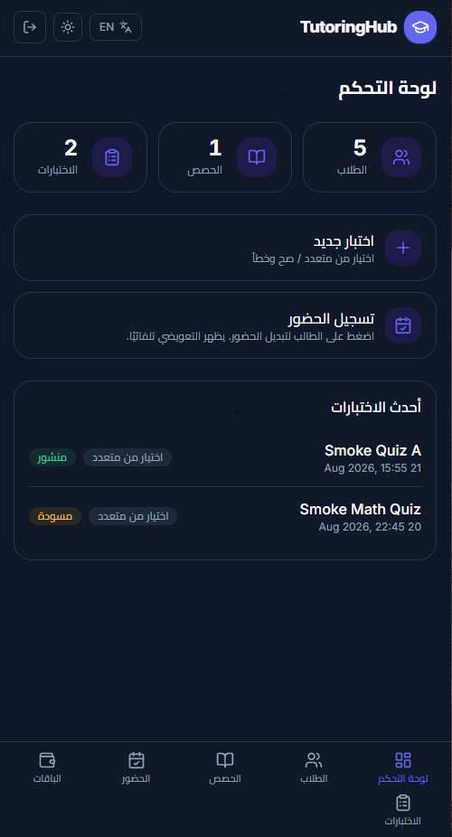
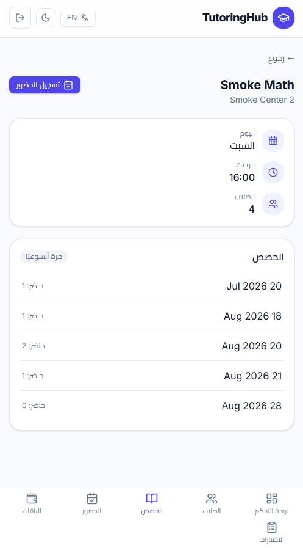
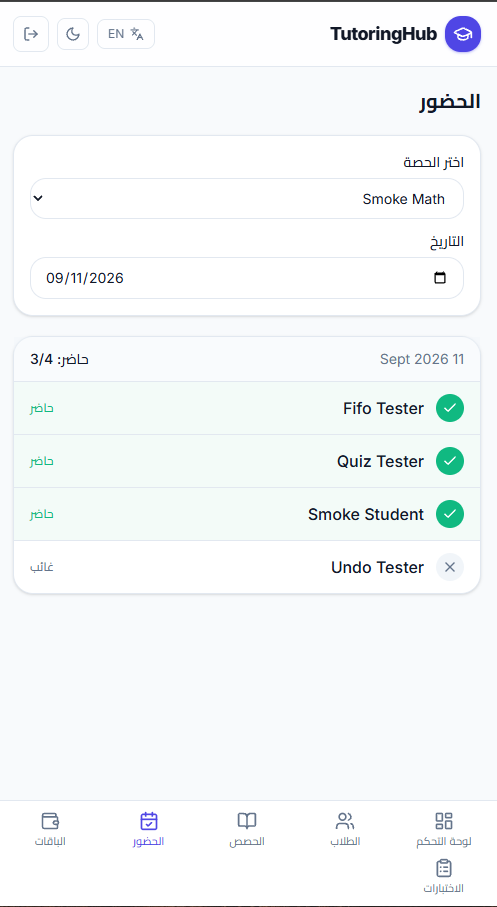
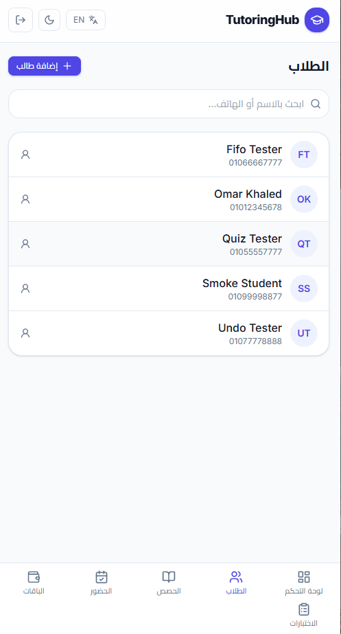
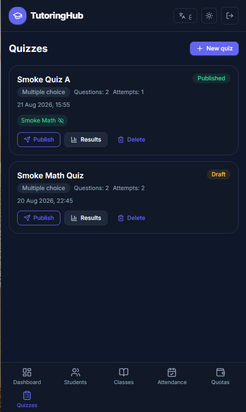
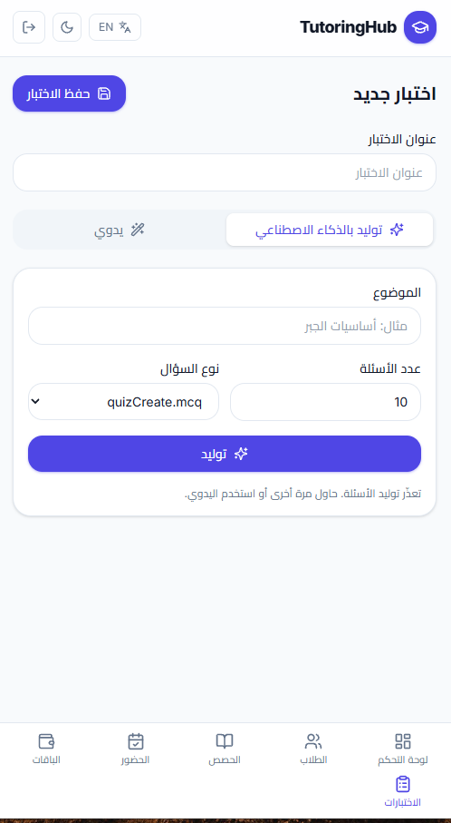

# TutoringHub — Tutoring Center SaaS

A tutoring-center management platform for teachers who run class groups in physical centers. It handles attendance tracking, attendance-based postpaid billing with FIFO quota coverage, student/teacher portals, and AI-assisted quiz generation — designed mobile-first with an Arabic RTL interface.


## Screenshots

| | | |
|:---:|:---:|:---:|
|  |  |  |
|  |  |  |

## Features

- **Class groups & sessions** — teachers organize students into class groups with reusable session schedules.
- **Attendance** — tick/un-tick attendance per session with an in-session make-up toggle; undo reverses quota consumption symmetrically.
- **Postpaid billing with FIFO quotas** — quota rows are append-only; a new row covers the oldest unpaid sessions first. Attendance is never blocked over money; unpaid sessions are simply marked unpaid.
- **Make-up logic** — a student attending a class they are not enrolled in consumes their own class quota; `IsMakeUp` is derived, never stored.
- **Enrollment & student portal** — students see their classes, quiz results, and live quota balance.
- **AI quiz generation (optional)** — generate quiz drafts with Google Gemini in a two-step flow: the teacher reviews and approves the draft before it is saved (human-in-the-loop, nothing is written to the database silently).

## Demo Credentials

The API seeds demo data automatically on first run (idempotent — checks existing records).

| Role | Username / Phone | Password / PIN |
|------|------------------|------------------|
| Teacher | `admin` | `admin123` |
| Student | `01055557777` | `2468` |

> These are demo credentials only. Change them before any real deployment.

## Architecture

Clean Architecture with one project per layer — dependencies point inward:

```
src/TutoringHub.Domain            Entities, enums, IApplicationDbContext
src/TutoringHub.Application       DTOs, FluentValidation validators, service interfaces & implementations
src/TutoringHub.Infrastructure    EF Core DbContext + configurations, migrations, JWT token service, Gemini AI client
src/TutoringHub.API               Thin controllers, middleware, service registration
tests/TutoringHub.Application.Tests   Service + validator tests on a mock DbContext
```

- **Tenancy** — all teacher data is scoped through the JWT claims (`ICurrentUserService`), never from URL or body.
- **Auth** — JWT access tokens, BCrypt password hashing, rotating refresh tokens stored as SHA-256 hashes, per-IP rate limiting on auth and AI endpoints.
- **Testability** — the full business-rule suite (141 xUnit tests) runs against an in-memory mock of `IApplicationDbContext`, with a DI smoke test that fails if any service registration is missed.

## Getting Started

### Prerequisites

- [.NET 8 SDK](https://dotnet.microsoft.com/download/dotnet/8.0)
- [Node.js](https://nodejs.org/) 20+
- [SQL Server](https://www.microsoft.com/en-us/sql-server) (local or Docker)
- [EF Core tools](https://learn.microsoft.com/ef/core/cli/dotnet): `dotnet tool install --global dotnet-ef`

### 1. Configure the database

Set the `DefaultConnection` string in `src/TutoringHub.API/appsettings.json`, then apply migrations:

```powershell
dotnet ef database update --project src/TutoringHub.Infrastructure --startup-project src/TutoringHub.API
```

Alternatively, delete the `Migrations` folder and start fresh:

```powershell
dotnet ef migrations add InitialCreate --project src/TutoringHub.Infrastructure --startup-project src/TutoringHub.API
dotnet ef database update --project src/TutoringHub.Infrastructure --startup-project src/TutoringHub.API
```

### 2. Run the API

```powershell
$env:ASPNETCORE_ENVIRONMENT = "Development"
$env:ASPNETCORE_URLS = "http://localhost:5293"
dotnet run --project src/TutoringHub.API
```

API is served at `http://localhost:5293`; interactive docs at `http://localhost:5293/swagger`.

### 3. Run the frontend

```powershell
cd frontend
npm install
npm run dev
```

Frontend is served at `http://localhost:5174` (proxies `/api` to the API).

## Running the Tests

```powershell
dotnet build TutoringHub.sln
dotnet test tests/TutoringHub.Application.Tests/TutoringHub.Application.Tests.csproj
```

## Gemini AI Integration (Optional)

The quiz generator calls Google Gemini. Without a key the app works fully except AI generation.

1. Create a free API key at [Google AI Studio](https://aistudio.google.com/).
2. Set it in `src/TutoringHub.API/appsettings.Development.json` (gitignored — never commit keys):

```json
{
  "Ai": {
    "ApiKey": "your-key-here",
    "Model": "gemini-3.6-flash"
  }
}
```

The AI client retries on transient failures (429/503), requests JSON-only responses, and maps provider errors to human-readable messages. Existing keys are never exposed to the frontend — generation happens server-side.

## Future Improvements

- Send the Gemini API key via the `x-goog-api-key` header instead of the URL query string (or migrate to OAuth2 bearer tokens) so keys never appear in proxy/access logs.
- Exponential backoff with `Retry-After` handling for AI calls.
- GitHub Actions CI pipeline with a build + test badge.